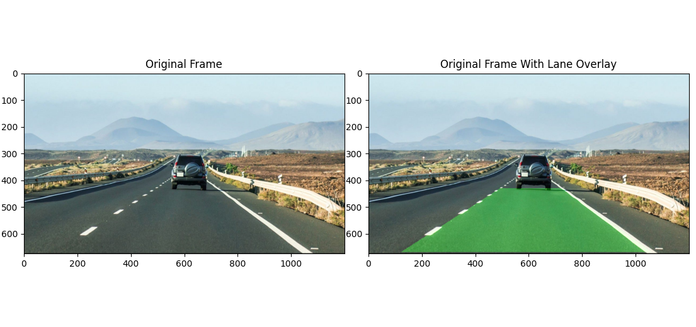
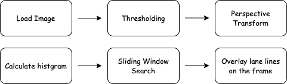

# opencv-lane-tracker
## Demo Image


## Environment
OS: Mac Version 13.0.1  
Python: 3.11.5  
OpenCV: 4.6.0.66  
Numpy: 1.25.2

## Workflow


Image data is composed of three-dimensional information in RGB. However, processing images in their native 3D form can increase computational costs and may lead to failures in image processing due to noise. Therefore, we first perform thresholding to convert the image into a binary format. Before conducting white line detection, we apply a perspective transform to the image. Perspective transformation allows us to eliminate noise in the upper part of the image. When white lines are correctly recognized, the transformed image will show two white lines drawn horizontally. We calculate the number of white pixels (value: 255) in the image and create a histogram based on this information. In areas with white lines, the histogram will have a convex shape. However, white lines are not always sharply drawn in the same positions, making it challenging to precisely identify the exact locations of white pixels. Therefore, we use the sliding window method to detect white lines window by window and accurately determine their positions.

## How to use
```bash
git clone git@github.com:Shuta-syd/opencv-lane-tracker.git
cd opencv-lane-tracker
pip install -r requirements.txt
python main.py
```

**Note**  
You have to change the value called `self.roi_points` which is for ROI (Region of Interest) in `main.py` to suit your image or video.
